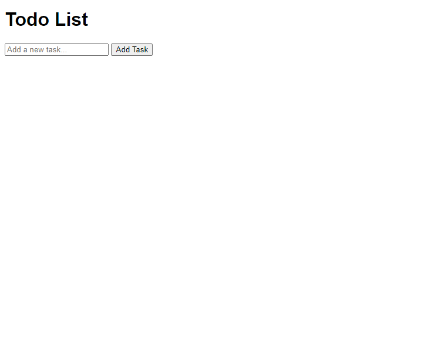
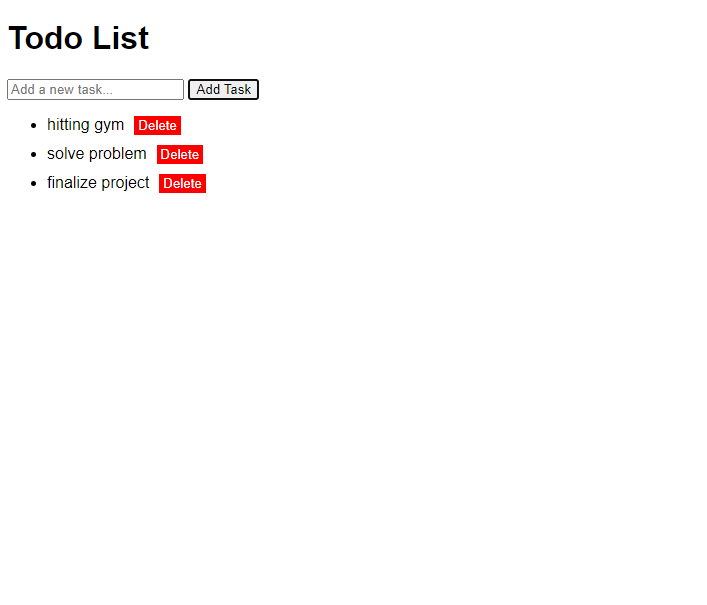
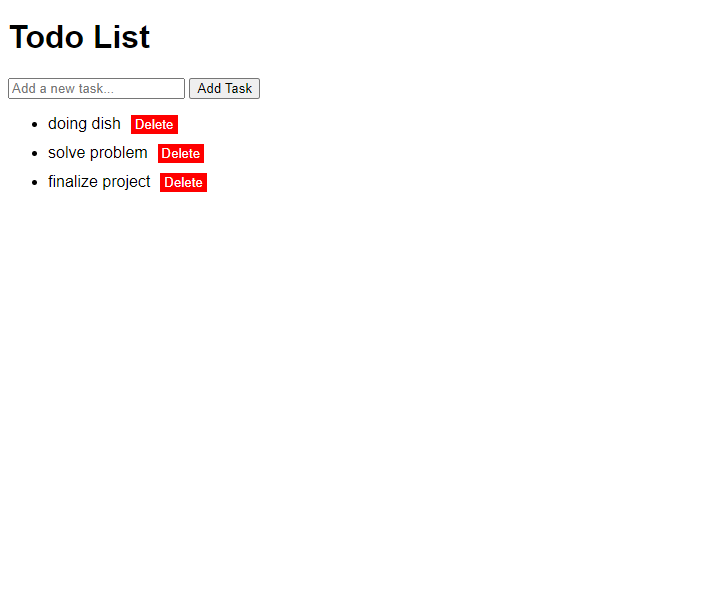

              # Todolist application

A simple Todo List application built using html, css, and javascript. The app allows users to add tasks, edit them, and remove them.

                    Features

-Add Tasks: users can enter a new task in the input field and add it to the list by clicking the "Add Task" button.

-Edit Tasks: Double-clicking a task allows users to edit the task name.

-Delete Tasks: Each task has a "Delete" button next to it, which can be clicked to remove the task from the list.

                   How to Use

Adding a Task:
Enter the task description in the input field at the top.
Click the "Add Task" button to add the task to the list.
Editing a Task:
Double-click on the task you want to edit. The task text will become an input field.
Modify the task as needed and either press Enter or click outside the input field to save the changes.
Deleting a Task:
Click the "Delete" button next to the task you want to remove. The task will be removed from the list.

                        installation

-Clone the Repository or download the zip file
-cd to WEBTRUCK
-open the index.html file

                              screen shoot of the pages
                              

### home screen

Description: The home page when you open at first.

### Task add

Description: the image shows the task after added with its delete button

### Editing a Task

Description: the image shows  the task after edited

